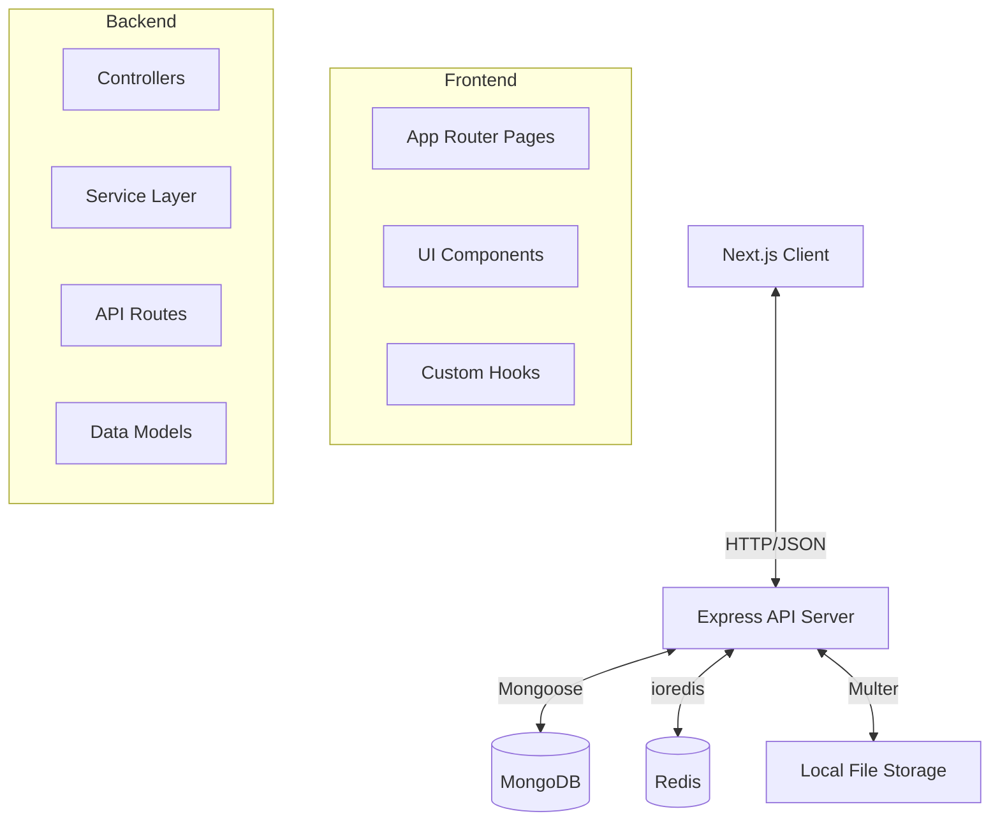

# Unheard India - Ethnography Research Platform

A comprehensive, scalable digital platform dedicated to documenting the rich heritage, cultural practices, and untold stories of India's marginalized and overlooked communities, including the Gadia Lohar nomadic blacksmiths and Bhoksa tribes.


---

## 📖 Table of Contents
1. [Our Mission & Academic Value](#our-mission--academic-value)
2. [Core Features](#core-features)
3. [System Architecture & Tech Stack](#system-architecture--tech-stack)
4. [Project Structure](#project-structure)
5. [Getting Started (Local Development)](#getting-started-local-development)
6. [API & Routing Summary](#api--routing-summary)
7. [Research Ethics & Data Security](#research-ethics--data-security)
8. [Contributing](#contributing)
9. [License & Usage Terms](#license--usage-terms)

---

## 🌍 Our Mission & Academic Value

The **Unheard India** ethnographic research platform is built to preserve, document, and share the rich cultural heritage of India's marginalized communities. By leveraging modern web technologies, we've created an accessible, interactive digital archive. 

Our primary goals are to:
- **Preserve Traditional Practices:** Document art forms, oral histories, and daily routines before they disappear.
- **Amplify Marginalized Voices:** Provide a highly visible platform for historically underrepresented groups.
- **Support Rigorous Research:** Give researchers, anthropologists, and academics robust, structured access to ethnographic data.
- **Educate The Public:** Raise awareness about India's incredibly diverse cultural tapestry.
- **Foster Direct Engagement:** Enable community members to actively participate in documenting their own living heritage.

---

## ✨ Core Features

### For Researchers & the Public
- **Community Documentation:** Detailed, peer-reviewed profiles of various communities alongside rich multimedia content.
- **Image & Artifact Gallery:** High-resolution photo galleries showcasing cultural artifacts, daily life, and traditional craftsmanship.
- **Documentary Section:** Curated documentaries, field recordings, and video content specific to the featured communities.
- **Research Data Management:** Structured storage, tagging, and retrieval of sensitive ethnographic field data.
- **Student Submissions:** A secure portal for university students and junior researchers to submit fieldwork and findings (`/student-submission`).
- **Interactive Maps:** Precise geographic mapping of community locations and historical migration routes using Leaflet.
- **Internationalization (i18n):** Support for multiple Indian languages to ensure local accessibility via `next-intl`.

### For Administrators
- **CMS Dashboard:** Secure admin-only routes to create, update, and delete community profiles (`/admin`).
- **Data Moderation:** Admins can approve, reject, and moderate student research data submissions.
- **Access Control:** Granular Role-Based Access Control (RBAC) to protect sensitive cultural data.

---

## 🏗️ System Architecture & Tech Stack

The application follows a decoupled **Client-Server Architecture** operating as a Monorepo.

### High-Level Architecture Diagram


### 💻 Frontend
- **Core:** Next.js 16.1 (App Router), React 19.2, TypeScript
- **Styling:** Tailwind CSS, Radix UI primitives, `clsx`, `tailwind-merge`
- **State Management:** Zustand
- **Data Fetching:** Axios, React Hook Form, Zod (Schema Validation)
- **Mapping & Charts:** Leaflet, Recharts
- **Internationalization:** `next-intl`

### ⚙️ Backend
- **Core:** Node.js, Express.js 4.22, TypeScript
- **Architecture Pattern:** Controller -> Service -> Model layer
- **Database:** MongoDB 7 (via Mongoose 8) with Replica Sets for transactions.
- **Caching & Rate Limiting:** Redis 7 for high-performance data retrieval and Express rate limiting.
- **Security:** Argon2 for password hashing, JWT for stateless authentication, Helmet, XSS-clean, HPP.
- **File Handling:** Multer
- **Observability:** OpenTelemetry & Pino logging.
- **Testing:** Vitest for Unit and Integration testing.

---

## 📂 Project Structure

```text
Ethnography-research-project/
├── client/                       # Next.js frontend application
│   ├── public/                   # Static assets (images, icons, svgs)
│   ├── src/
│   │   ├── app/                  # Next.js App Router definitions
│   │   ├── components/           # Reusable UI components (Radix UI + Tailwind)
│   │   ├── hooks/                # Custom data fetching hooks
│   │   ├── lib/                  # Utilities (Axios config, etc.)
│   │   ├── services/             # API integration calls
│   │   └── types/                # Shared TypeScript definitions
│   └── package.json
│
├── server/                       # Express backend API
│   ├── scripts/                  # DB Seeding and environment checks
│   ├── src/
│   │   ├── config/               # DB, Redis, and App configurations
│   │   ├── controllers/          # Request handling and response formatting
│   │   ├── middlewares/          # Security, auth, & validation checks
│   │   ├── models/               # MongoDB / Mongoose schemas
│   │   ├── routes/               # API endpoint definitions
│   │   ├── services/             # Business logic layer
│   │   └── utils/                # Helper functions
│   ├── tests/                    # Vitest integration and unit tests
│   └── package.json
│
├── docs/                         # Internal architectural & feature docs (PRD, ROADMAP)
├── docker-compose.yml            # Local development orchestration
└── docker-compose.prod.yml       # Production deployment configuration
```

---

## 🚀 Getting Started (Local Development)

### Prerequisites
- **Node.js:** v20.x or higher
- **Docker & Docker Compose:** Required for running the database replica sets and cache locally.
- **Git**

### 1. Docker Quick Start (Recommended)
The easiest way to spin up the entire database, cache, backend, and frontend stack. The `docker-compose.yml` sets up a MongoDB replica set (`rs0`) required for advanced database transactions.

1. **Clone the repository:**
   ```bash
   git clone https://github.com/Gauravkumar260/Ethnography-research-project.git
   cd Ethnography-research-project
   ```

2. **Start the application stack:**
   ```bash
   docker compose up -d
   ```

3. **Seed necessary reference data (Admin user, base communities):**
   ```bash
   docker compose exec server npm run seed:admin
   docker compose exec server npm run seed:communities
   ```

4. **Access the platforms:**
   - **Frontend App:** http://localhost:3000
   - **Backend API:** http://localhost:5000
   - **MongoDB Express (DB Viewer):** http://localhost:8081 *(Development only)*

*Note: To view real-time server logs, run `docker compose logs -f server`.*

### 2. Manual Installation
If you prefer running the services directly on your host machine to debug or develop without Docker overhead.

**Setup Backend:**
```bash
cd server
npm install
cp .env.example .env.local
# Ensure your local MongoDB (running as a replica set) and Redis instances are active. Update .env.local if needed.
npm run dev
```

**Setup Frontend (in a new terminal):**
```bash
cd client
npm install
cp .env.example .env.local
npm run dev
```

---

## 🔌 API & Routing Summary

### Frontend Key Routes
- `/` : Public homepage conveying project overview.
- `/communities` : Browse all documented ethnographic groups.
- `/research` : Access published findings and field data.
- `/student-submission` : Portal for academic contributions.
- `/admin` : Secured CMS dashboard for content moderation.

### Backend Base API: `http://localhost:5000/api/v1`
- `POST /auth/register`, `POST /auth/login` : JWT authentication endpoints.
- `GET /communities` : Retrieve all community profiles.
- `POST /communities` : Create a community profile (Admin Protected).
- `GET /research` : Query structured ethnographic field data.
- `POST /research/submit` : Student fieldwork submission endpoint.

*(For a complete list of endpoints, schemas, and payload requirements, see the respective route files inside `server/src/routes`)*

---

## 🧪 Testing

The backend utilizes `Vitest` for comprehensive testing. 

To run the backend test suite:
```bash
cd server
npm run test
# OR for watch mode
npm run test:watch
```

---

## 🛡️ Research Ethics & Data Security

Working with ethnographic data involves profound responsibility to the communities documented.

- **Informed Consent:** All media and data managed by this platform must be collected with documented, informed consent.
- **Data Privacy:** Sensitive cultural information and precise geolocations, where applicable, are protected and tiered via access control (Admin/Researcher roles only).
- **Immutable Audit Logs:** The backend maintains strict, immutable logs of content modification and access to ensure data integrity and track potential abuse.

---

## 🤝 Contributing

We welcome contributions from both developers (code, bug fixes) and researchers (data, documentation improvements).

1. Fork the repository.
2. Create your feature branch (`git checkout -b feature/new-component`).
3. Commit your changes logically (`git commit -m 'Add new component'`).
4. Ensure all backend tests pass (`cd server && npm run test`).
5. Push to the branch (`git push origin feature/new-component`).
6. Open a Pull Request clearly detailing your changes.

**Note:** Code contributions must adhere strictly to the project's TypeScript configuration, Biome/ESLint settings, and styling standards.

---

## 📜 License & Usage Terms

This project is created for **educational and research purposes**.

- **Academic/Educational Use:** Free to use and adapt.
- **Code Adaptation:** Attribution is required when reusing portions of this codebase for other platforms.
- **Commercial Use:** Strictly requires direct permission from the author.

---
**Gaurav Kumar**  
GitHub: [@Gauravkumar260](https://github.com/Gauravkumar260)  
*Made for preserving cultural heritage. Last Updated: March 2026.*